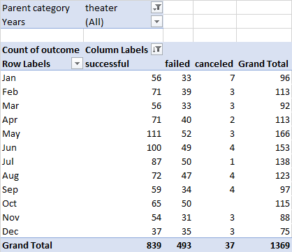
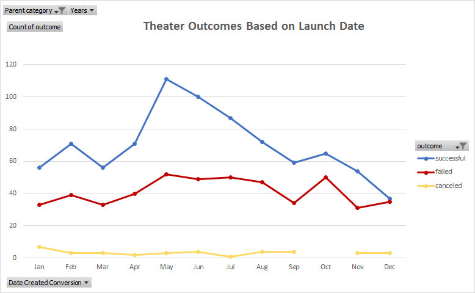
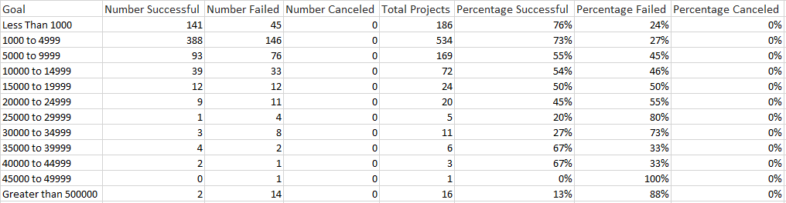
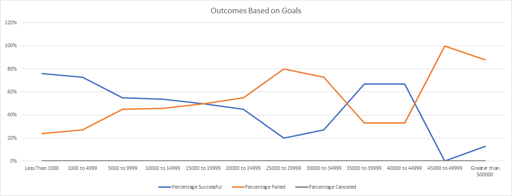
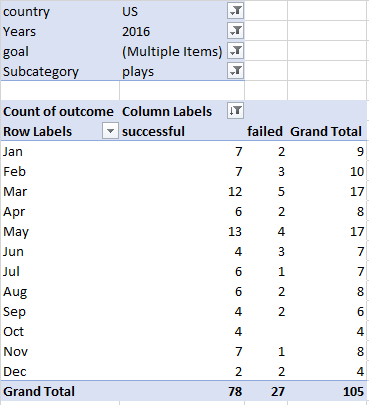
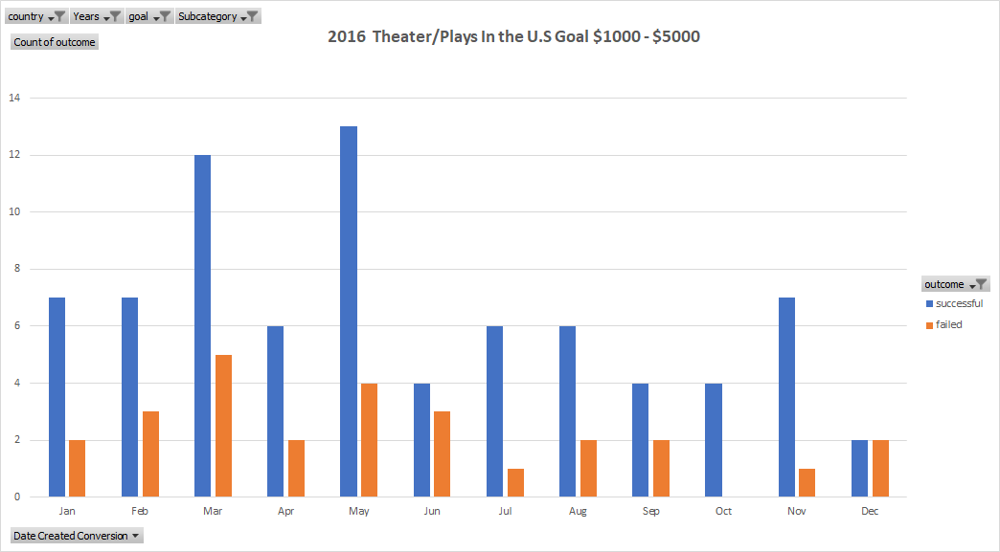

# **Data Analysis for Kickstarter Campaign**

## **Overview of Project**
Kickstarter is a crowdfunding platform which allows orgonizations  to raise capital for their campaigns. Based on the data from past nine years, clients were able to raise over $92 million on the Kickstarter platform and the success of those projects was dependent on multiple factors, including their release date, funding goals, country of origin, and category of their campaign.
## **Purpose**
Louise, as a participant in the Kickstarter crowdfuning for her play "Fever", is looking to understand if there is a correlation between launch date and funding goal, that affected the outcome of her campaign. 
## **Analysis and Challenges**

### **Analysis of Outcomes Based on Launch Date**
Louise’s kickstarter campaign falls into the category of theater plays and her main concern was to understand if her choice of the launch date had an effect on the outcome. 
Therefore, we filtered the data set to reflect only campaigns within the theater category and grouped the number of ‘successful’, ‘failed', and ‘canceled’ outcomes by the month of their launch date.

Using the data from the table above, we created a line chart that shows the different outcomes of the theatre campaigns month to month, for easier comprehension.

### **Analysis of Outcomes Based on Goals**
In order to understand the probability of each outcome based on the funding goals, we created 12 dollar-amount ranges, so projects can be grouped based on their goal amount. To stay relevant to the client’s request, we filtered the outcomes to be in the theatre/play category. 

Analyzing the total number of campaigns in each dollar-amount range allowed us to calculate the probability of campaigns being ‘successful’, ‘failed’, or ‘canceled’, based on their funding goal. To showcase the data we utilized the line graph. 

### **Challenges and Difficulties Encountered**
Being presented with a large dataset, we faced a challenge of having to filter the most relevant information to cater to the client’s request, narrowing down the data by funding goal, country of origin, category, and launch date.

Another challenge was to present the analyzed data in the format that would be the most effective for the client’s understanding. We had to choose the type of visual  representation that would allow us to easily comprehend the trends of outcomes based on various factors. 
 

## **Results**

#### **What are two conclusions you can draw about the Outcomes based on Launch Date?**
Based on our data, the highest success rate was determined to be during the months of February, April, May, June, and July. However, during the month of May, we recorded the popularity of the theatre campaigns to be at its highest, which could contribute to the overall success. Taking this data into consideration, Louise’s kickstarter campaign should have launched a month earlier, because starting in June, there was a consistent decline in the number of successful campaigns.
Another conclusion is that this representation is not the most adequate since our graph is based on the number of the participants, rather than on the percentage of ‘successful’, ‘failed’, or ‘canceled’ campaigns. Therefore, for a better portrayal of Louise’s concern, we could have applied more filters to stay relevant to her play. 

#### **What can you conclude about the Outcomes based on Goals?**
The fundraiser campaigns with a goal of up to $10,000 saw a greater rate of success. Fewer projects had a positive outcome as the goal of the fundraiser increased. The success rate also depends on a number of projects within each category.
Despite the fact that Louise’s goal of funding was within the most successful range, this data is not sufficient to understand the reasoning behind her campaign’s failure. 

#### **What are some limitations of this dataset?**
<ul>
<li>In our dataset we are not provided with an outlook on the economic state of the country in which the campaign was launched.</li> 

<li>The duration for which the campaign was available on the kickstarter platform, could have had an impact on the outcome.</li>

<li>In the dataset we were provided with multiple currencies of goal and pledge funding, without standardizing the tender of money for the most accurate results.</li> 

<li>The marketing resources invested in each campaign could have affected its outcome greatly.</li> 
</ul>

#### **What are some other possible tables and/or graphs that we could create?**
In order to meet client's request, we should have narrowed down the dataset by the year of launch, country of origin, and goal amount. We also need to focus on success rate, rather than number of participants. The graph below shows a better representation of data to match our client's campaign, as we focus on the plays launched in  2016 in the U.S, within the $1,000 to $5,000 goal category. For better visualization we used a bar graph to show a success to failure comparison on a monthly basis. 

